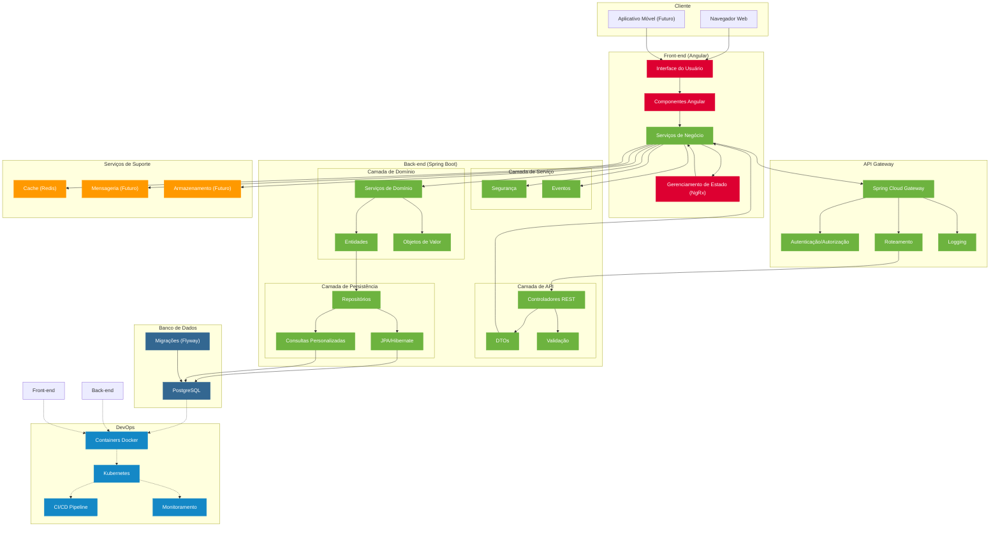

```mermaid
flowchart TD
    subgraph "Cliente"
        Browser["Navegador Web"]
        Mobile["Aplicativo Móvel (Futuro)"]
    end

    subgraph "Front-end (Angular)"
        UI["Interface do Usuário"]
        Components["Componentes Angular"]
        Services["Serviços"]
        State["Gerenciamento de Estado (NgRx)"]
    end

    subgraph "API Gateway"
        Gateway["Spring Cloud Gateway"]
        Auth["Autenticação/Autorização"]
        Routing["Roteamento"]
        Logging["Logging"]
    end

    subgraph "Back-end (Spring Boot)"
        subgraph "Camada de API"
            Controllers["Controladores REST"]
            DTOs["DTOs"]
            Validation["Validação"]
        end
        
        subgraph "Camada de Serviço"
            Services["Serviços de Negócio"]
            Security["Segurança"]
            Events["Eventos"]
        end
        
        subgraph "Camada de Domínio"
            Entities["Entidades"]
            ValueObjects["Objetos de Valor"]
            DomainServices["Serviços de Domínio"]
        end
        
        subgraph "Camada de Persistência"
            Repositories["Repositórios"]
            JPA["JPA/Hibernate"]
            Queries["Consultas Personalizadas"]
        end
    end

    subgraph "Banco de Dados"
        PostgreSQL["PostgreSQL"]
        Migrations["Migrações (Flyway)"]
    end

    subgraph "Serviços de Suporte"
        Cache["Cache (Redis)"]
        Messaging["Mensageria (Futuro)"]
        Storage["Armazenamento (Futuro)"]
    end

    subgraph "DevOps"
        Docker["Containers Docker"]
        K8s["Kubernetes"]
        CI["CI/CD Pipeline"]
        Monitoring["Monitoramento"]
    end

    Browser --> UI
    Mobile --> UI
    UI --> Components
    Components --> Services
    Services --> State
    State --> Services
    Services --> Gateway

    Gateway --> Auth
    Gateway --> Routing
    Gateway --> Logging
    Routing --> Controllers

    Controllers --> DTOs
    Controllers --> Validation
    DTOs --> Services
    Services --> Security
    Services --> Events
    Services --> DomainServices
    DomainServices --> Entities
    DomainServices --> ValueObjects
    Entities --> Repositories
    Repositories --> JPA
    Repositories --> Queries
    JPA --> PostgreSQL
    Queries --> PostgreSQL
    Migrations --> PostgreSQL

    Services --> Cache
    Services --> Messaging
    Services --> Storage

    PostgreSQL -.-> Docker
    Back-end -.-> Docker
    Front-end -.-> Docker
    Docker -.-> K8s
    K8s -.-> CI
    K8s -.-> Monitoring

    classDef angular fill:#DD0031,color:white,stroke:#DD0031
    classDef spring fill:#6DB33F,color:white,stroke:#6DB33F
    classDef database fill:#336791,color:white,stroke:#336791
    classDef devops fill:#1488C6,color:white,stroke:#1488C6
    classDef support fill:#FF9900,color:white,stroke:#FF9900

    class UI,Components,Services,State angular
    class Gateway,Auth,Routing,Logging,Controllers,DTOs,Validation,Services,Security,Events,DomainServices,Entities,ValueObjects,Repositories,JPA,Queries spring
    class PostgreSQL,Migrations database
    class Docker,K8s,CI,Monitoring devops
    class Cache,Messaging,Storage support
```