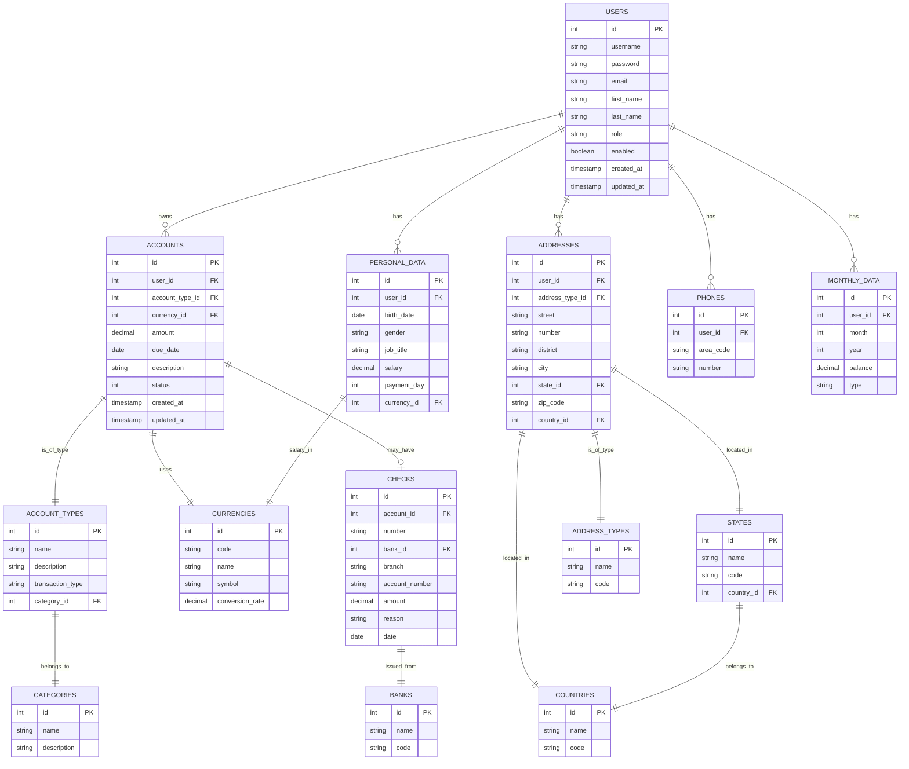

```mermaid
erDiagram
    USERS {
        int id PK
        string username
        string password
        string email
        string first_name
        string last_name
        string role
        boolean enabled
        timestamp created_at
        timestamp updated_at
    }
    
    PERSONAL_DATA {
        int id PK
        int user_id FK
        date birth_date
        string gender
        string job_title
        decimal salary
        int payment_day
        int currency_id FK
    }
    
    ACCOUNTS {
        int id PK
        int user_id FK
        int account_type_id FK
        int currency_id FK
        decimal amount
        date due_date
        string description
        int status
        timestamp created_at
        timestamp updated_at
    }
    
    ACCOUNT_TYPES {
        int id PK
        string name
        string description
        string transaction_type
        int category_id FK
    }
    
    CATEGORIES {
        int id PK
        string name
        string description
    }
    
    CURRENCIES {
        int id PK
        string code
        string name
        string symbol
        decimal conversion_rate
    }
    
    CHECKS {
        int id PK
        int account_id FK
        string number
        int bank_id FK
        string branch
        string account_number
        decimal amount
        string reason
        date date
    }
    
    BANKS {
        int id PK
        string name
        string code
    }
    
    ADDRESSES {
        int id PK
        int user_id FK
        int address_type_id FK
        string street
        string number
        string district
        string city
        int state_id FK
        string zip_code
        int country_id FK
    }
    
    PHONES {
        int id PK
        int user_id FK
        string area_code
        string number
    }
    
    MONTHLY_DATA {
        int id PK
        int user_id FK
        int month
        int year
        decimal balance
        string type
    }
    
    STATES {
        int id PK
        string name
        string code
        int country_id FK
    }
    
    COUNTRIES {
        int id PK
        string name
        string code
    }
    
    ADDRESS_TYPES {
        int id PK
        string name
        string code
    }

    USERS ||--o{ PERSONAL_DATA : has
    USERS ||--o{ ACCOUNTS : owns
    USERS ||--o{ ADDRESSES : has
    USERS ||--o{ PHONES : has
    USERS ||--o{ MONTHLY_DATA : has
    
    ACCOUNTS ||--|| ACCOUNT_TYPES : is_of_type
    ACCOUNTS ||--|| CURRENCIES : uses
    ACCOUNTS ||--o| CHECKS : may_have
    
    ACCOUNT_TYPES ||--|| CATEGORIES : belongs_to
    
    ADDRESSES ||--|| STATES : located_in
    ADDRESSES ||--|| COUNTRIES : located_in
    ADDRESSES ||--|| ADDRESS_TYPES : is_of_type
    
    STATES ||--|| COUNTRIES : belongs_to
    
    PERSONAL_DATA ||--|| CURRENCIES : salary_in
    
    CHECKS ||--|| BANKS : issued_from
```